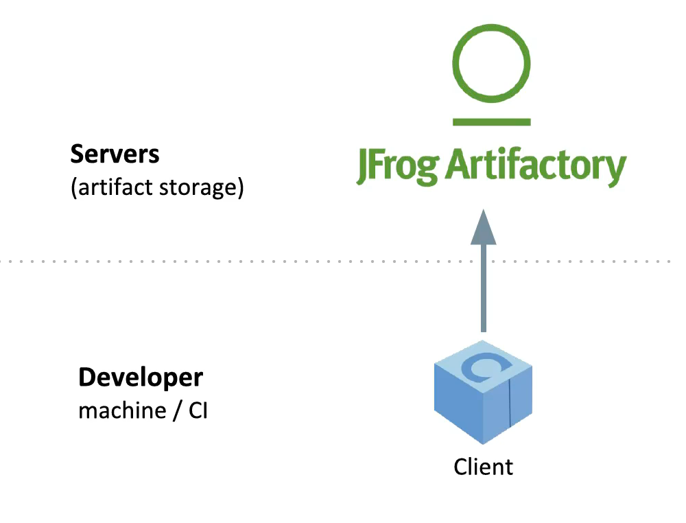
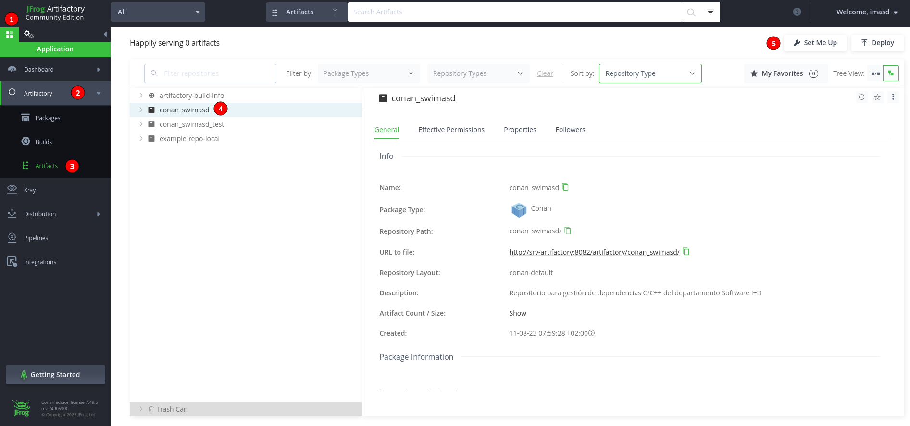
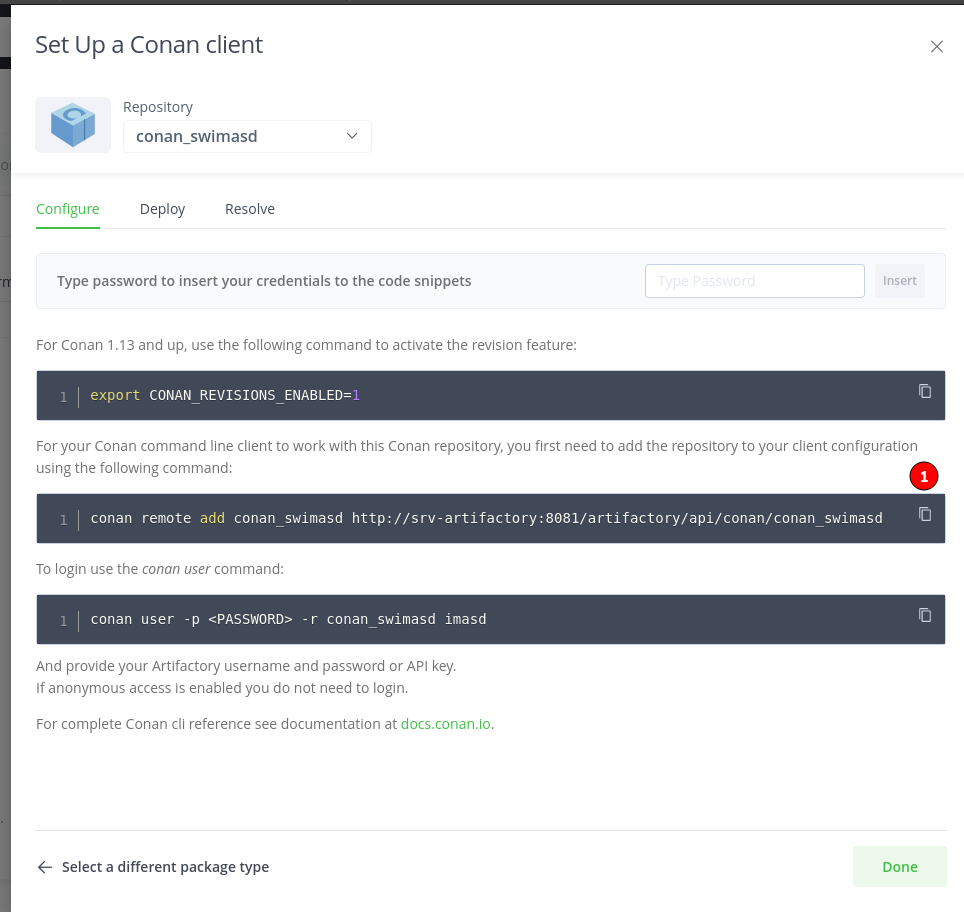

CONAN
=====

.. image:: ../images/conan_overview.png
  :width: 800
  :alt: Alt text que no se para que vale

- Dependencies are placed typically on code, on build system files and now on Conan recipes to resolve them.

**conanfile.txt**
-----------------

Tell Conan our dependencies and our build system. For that it has 2 sections corresponding on dependencies (*requires*) and build systems (*generators*)

.. code-block:: text
  :lineno-start: 1

   [requires]
   Poco/1.7.2@lasote/stable

   [generators]
   cmake

.. note::
  
  [pkg]/[version]@[user]/[channel] is called the **recipe reference**
  No user/channel for official packages downloaded from conan-io, only for custom packages
  user = company/team/identifier
  channel = convention is testing or stable

**Conan Center Index**
----------------------

 [https://github.com/conan-io/conan-center-index] is the source index of recipes of the ConanCenter package repository for Conan.

.. image:: ../images/conan_center_index.png
  :width: 800

[conan **install**]
~~~~~~~~~~~~~~~~~~~

To install dependencies (direct dependencies and transitive dependencies), download binaries or the source code and build if no exist(or specified by us):

.. code-block:: console

  /connanfile/txt/path:$ mkdir build
  /connanfile/txt/path:$ cd build/ && conan install ..
  # or
  /connanfile/txt/path:$ conan install -if build .
  # or specifying build version of the package:
  /connanfile/txt/path:$ conan install -if build . -s build_type=Debug

Conan generates helper build system files containing variables to consume later:

.. code-block:: console

  build/conanbuildinfo.cmake
  build/conanbuildinfo.txt
  build/conaninfo.txt
  build/conan.lock
  build/graph_info.json

**conanbuildinfo.cmake** contains CONAN cmake variables that I need to use in my CMakeLists.txt:

.. code-block:: cmake
  :caption: CMakeLists.txt snippet
  
  ...
  include(${CMAKE_BINARY_DIR}/conanbuildinfo.cmake)
  conan_basic_setup()
  ...
  target_link_libraries(project_name ${CONAN_LIBS})
  #some times needed:
  #target_link_libraries(project_name CONAN_PKG::poco)
  ...

Using the **cmake_find_package** instead of the plain **cmake** generator we no need to add conan especific content to the CMakeLists.txt:

.. code-block:: cmake
  :caption: Example CMakeLists.txt
  :linenos:
  :lineno-start: 1
  :emphasize-lines: 6,7,9,10,13
  :name: <reference-label>

  cmake_minimum_required(VERSION 3.0)
  project(timer)
  add_compile_options(-std=c++11)

  # Using the "cmake_find_package" generator, files are in the bin dir
  set(CMAKE_MODULE_PATH ${CMAKE_BINARY_DIR} ${CMAKE_MODULE_PATH})
  set(CMAKE_PREFIX_PATH ${CMAKE_BINARY_DIR} ${CMAKE_PREFIX_PATH})

  find_package(Boost REQUIRED)
  find_package(Poco REQUIRED)

  add_executable(timer timer.cpp)
  target_link_libraries(timer Poco::Poco Boost::Boost)

.. note::

  Generators generates text files to be used in the build system. In this the CMake cases generates **conanbuildinfo.cmake** or **FindXXXX.cmake** in the last case.
  We can generate a text file with the native compiler arguments without generators specifying *-g compiler_args*:

  *conan install . -g compiler_args*
  
  and then use:

  *g++ timer.cpp @conanbuildinfo.args -o timer -std=c++11*

[conan **info**]
~~~~~~~~~~~~~~~~

To show the dependecies graph as text:

.. code-block:: console

  /connanfile/txt/path/build:$ conan info .. # --graph=file.html to output graphically as html file

.. note::
  
  ${HOME}/.conan/ is our local cache folder

- [**build**] Now we can compile our code:
.. code-block:: console

   /connanfile/txt/path/build:$ cmake .. -DCMAKE_BUILD_TYPE=Debug
   /connanfile/txt/path/build:$ cmake --build .

[conan **search**]
~~~~~~~~~~~~~~~~~~~

Search for packages on the local cache, all connan packages and their versions are available in my local system. To see info of a specific package can type:

.. code-block:: console

   $ conan search # to get all packages by its recipe reference pkg/0.1@user/channel
   $ conan search pkg # filter by filter short name
   $ conan seach pkg@ # to show details TODO: undertand how its works, pkg@ or pkg/0.1@user/channel@ ...
   # --table=file.html to output to html file

[conan **search -r[=REMOTE|REMOTE]**]
*****************************************

Search for packages on the remote you select

.. code-block:: console

   $ conan search -r
   # -r=myremote to search on a remote specifically(conancenter is the name of the remote by default)

.. code-block:: console

  conan@48674d6a3546:~/training/consumer/build$ conan search zlib/1.2.13@
  Existing packages for recipe zlib/1.2.13:

    Package_ID: 19729b9559f3ae196cad45cb2b97468ccb75dcd1
        [options]
            fPIC: True
            shared: False
        [settings]
            arch: x86_64
            build_type: Release
            compiler: gcc
            compiler.version: 10
            os: Linux
        Outdated from recipe: False

    Package_ID: 75e99b627c196b65c439728670655ec3c366b334
        [options]
            fPIC: True
            shared: False
        [settings]
            arch: x86_64
            build_type: Debug
            compiler: gcc
            compiler.version: 10
            os: Linux
        Outdated from recipe: False

.. image:: ../images/conan_package_install.png
  :caption: Package install process. First in the local cache and then remote search by index order.

Building packages
---------------------------

  1.- Create the recipe

  2.- Build for desired configurations

Recipe **conanfile.py**
~~~~~~~~~~~~~~~~~~~~~~~~~

.. code-block:: python

  from conans import ConanFile, AutoToolsBuildEnvironment
  from conans import tools

  class HelloConan(ConanFile):
    name = "hello"
    version = "0.1"
    settings = "os", "compiler", "build_type", "arch"
    
    def source(self):
        self.run("git clone https//github/memshared/hello.git")

    def build(self):
        cmake = CMake(self.settings)
        # example 1
        cmake.configure(source_folder="hello")
        cmake.build()
        # example 2
        self.run('cmake hello %s' % (cmake.command_line))
        self.run("cmake --build . %s" % cmake.build_config)

    def package(self):
        self.copy("*.h", dst="include", src="hello  ") # from local hello folder files *.h to local package cache include folder
        self.copy("*.lib", dst="lib", keep_path=False) # .lib for Windows systems
        self.copy("*.a", dst="lib", keep_path=False) # .a for Unix systems

    def package_info(self):
        self.cpp_info.libs = ["hello"] # libs produced for this project
        # self.cpp_info.libdirs = ["lib"] # default value, directories to search the lib
        # self.cpp_info.includedirs = ["include"] # default value, directories to search the headers

def **source** (self)
~~~~~~~~~~~~~~~~~~~~~~~~~~~~~~~~~~~~~~

Execute whatever command to obtain the sources

def **build** (self)
~~~~~~~~~~~~~~~~~~~~~~~~~~~~~~~~~~~~~~

Responsable to invoque the build system.
We can use **self.run** for execute whatever command but Conan provide helper classes for most popular system as cmake, msbuild, autotools, etc. Here we can see **CMake class**.

def **package** (self)
~~~~~~~~~~~~~~~~~~~~~~~~~~~~~~~~~~~~~~

Responsable to capture artifacts produced by the build system.

We use here **self.copy** to copy from local filesystem to Conan local cache.

def **package_info** (self)
~~~~~~~~~~~~~~~~~~~~~~~~~~~~~~~~~~~~~~

Define variables available for the package consumers that store in a special dictionary **cpp_info**

[conan **new**]
~~~~~~~~~~~~~~~~~~~
Creates template files to be filled later to create the package.

.. code-block:: console

    $ conan new [package]/[version] # generate template
    $ ls
    conanfile.py # skeleton for the new package

[test_package **conan new -t**]
**********************************

It is a new kind of test that checks if the conan package and package_info method are completely correct and the package directory has the necessary files in all the right folders.
If we run the command **conan new ... -t** in the package creation, conan creates the test_package itself.
The when execute **connan create** conan run the test_package and return non-zero value if test_package fails.
The test_package run in local folder and no add nothing to the local cache.

[in-source recipe **conan new -s**]
*********************************************

For create from local source add a **-s** option to conan new. Nothing changes except the lack of remote repository and that the source match a pattern is copied to the local cache, called **exports_sources**

.. code-block:: python
  :emphasize-lines: 3,5

  ...
  generators = "cmake"
  exports_sources = "src/*"

  # NO SOURCE METHOD

  def config_options(self):
  ...

.. note::
  
  There are a third method to obtain the sources called **SCM** but not explained here, just for the record.

[conan **create**]
~~~~~~~~~~~~~~~~~~~
Builds artifacts, including the whole package
+V+ TODO: add command options

.. code-block:: console

  $ conan create . pe/testing # Release by default
  $ conan create . pe/testing -s build_type=Debug
  $ conan search hello/0.1@pe/testing 
  Existing packages for recipe hello/0.1@pe/testing:

  Package_ID: a25d6c83542b56b72fdaa05a85db5d46f5f0f71c
      [options]
          fPIC: True
          shared: False
      [settings]
          arch: x86_64
          build_type: Debug
          compiler: gcc
          compiler.libcxx: libstdc++11
          compiler.version: 10
          os: Linux
      Outdated from recipe: False

  Package_ID: b173bbda18164d49a449ffadc1c9e817f49e819d
      [options]
          fPIC: True
          shared: False
      [settings]
          arch: x86_64
          build_type: Release
          compiler: gcc
          compiler.libcxx: libstdc++11
          compiler.version: 10
          os: Linux
      Outdated from recipe: False

.. collapse:: How to store conan its packages in local cache on the filesystem

  .. code-block:: console

    $ tree -I '.git|CMakeFiles|*.cmake|CMakeCache.txt' ~/.conan/data/hello/0.1/pe/testing
    ${HOME}/.conan/data/hello/0.1/pe/testing
    ├── package # this is the main location of the packages (created or downloaded)
    │   ├── a25d6c83542b56b72fdaa05a85db5d46f5f0f71c
    │   │   ├── conaninfo.txt
    │   │   ├── conanmanifest.txt
    │   │   ├── include
    │   │   │   └── hello.h
    │   │   └── lib
    │   │       └── libhello.a
    │   └── b173bbda18164d49a449ffadc1c9e817f49e819d
    │       ├── conaninfo.txt
    │       ├── conanmanifest.txt
    │       ├── include
    │       │   └── hello.h
    │       └── lib
    │           └── libhello.a
    ├── build
    │   ├── a25d6c83542b56b72fdaa05a85db5d46f5f0f71c
    │   │   ├── bin
    │   │   │   └── greet
    │   │   ├── conanbuildinfo.txt
    │   │   ├── conaninfo.txt
    │   │   ├── hello
    │   │   │   ├── CMakeLists.txt
    │   │   │   ├── hello.cpp
    │   │   │   ├── hello.h
    │   │   │   ├── LICENSE
    │   │   │   ├── main.cpp
    │   │   │   └── readme.md
    │   │   ├── lib
    │   │   │   └── libhello.a
    │   │   └── Makefile
    │   └── b173bbda18164d49a449ffadc1c9e817f49e819d
    │       ├── bin
    │       │   └── greet
    │       ├── conanbuildinfo.txt
    │       ├── conaninfo.txt
    │       ├── hello
    │       │   ├── CMakeLists.txt
    │       │   ├── hello.cpp
    │       │   ├── hello.h
    │       │   ├── LICENSE
    │       │   ├── main.cpp
    │       │   └── readme.md
    │       ├── lib
    │       │   └── libhello.a
    │       └── Makefile
    ├── export
    │   ├── conanfile.py
    │   └── conanmanifest.txt
    ├── export_source
    ├── locks
    │   ├── a25d6c83542b56b72fdaa05a85db5d46f5f0f71c
    │   └── b173bbda18164d49a449ffadc1c9e817f49e819d
    ├── metadata.json
    ├── metadata.json.lock
    └── source
        └── hello
            ├── CMakeLists.txt
            ├── hello.cpp
            ├── hello.h
            ├── LICENSE
            ├── main.cpp
            └── readme.md

From scratch
~~~~~~~~~~~~~~~~~~~~~~~~~

.. code-block:: console

    $ conan new [package]/[version] # generate template
    $ conan create . user/testing  # create package in local cache
    $ conan search # show local cache
    # conan search hello/0.1@user/testing
    # conan create . user/testing -s build_type=Debug
    # conan search hello/0.1@user/testing
    $ conan new [package]/[version] -s # from local sources

[conan **remote**]
~~~~~~~~~~~~~~~~~~~

.. code-block:: console

  $ conan remote list
  $ conan remote add <name> <URL from SetMeUp>

[conan **upload**]
~~~~~~~~~~~~~~~~~~~

Upload packages to a remote specifically. By default only the recipe is upload and we need to add --all to upload binaries.

.. code-block:: console

    $ conan upload "hello*" -r conan_swimasd
    $ conan upload "hello*" -r conan_swimasd --all --confirm
    $ conan search "hello*" -r conan_swimasd # to check that is really uploaded

.. collapse:: Local cache filesystem

  .. code-block:: console

    ${HOME}/.conan/data/hello/0.1/pe/testing
    └── dl
        └── pkg
            ├── a25d6c83542b56b72fdaa05a85db5d46f5f0f71c
            │   └── conan_package.tgz
            └── b173bbda18164d49a449ffadc1c9e817f49e819d
                └── conan_package.tgz

[conan **export**]
~~~~~~~~~~~~~~~~~~~

Export the recipe to local cache