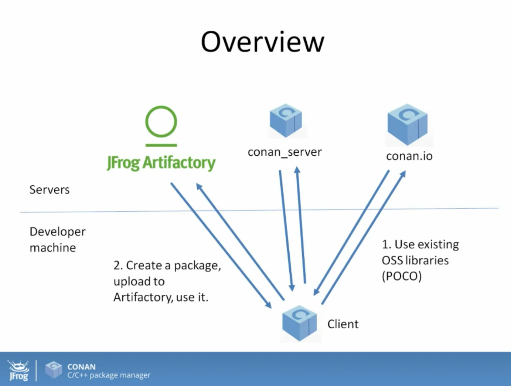
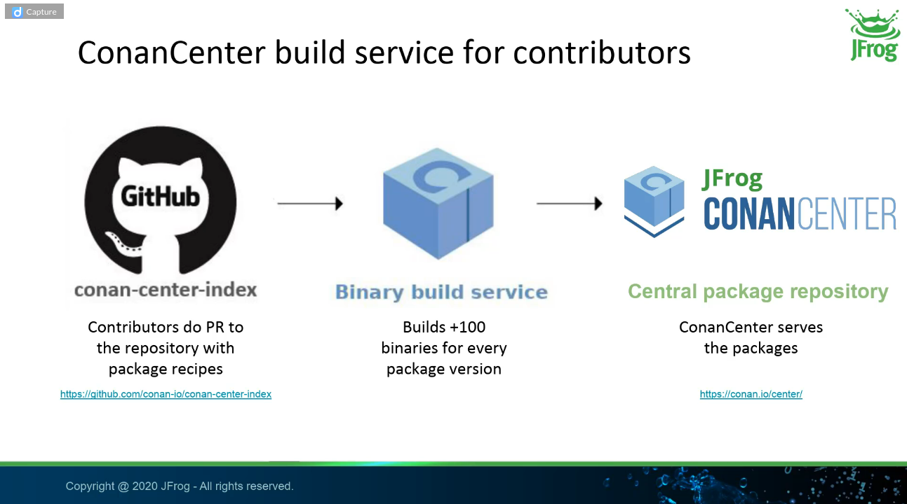
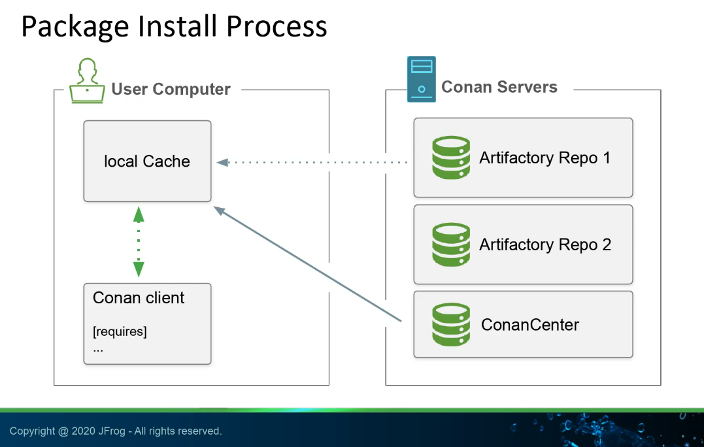

CONAN
=====

- Dependencies are placed typically on code, on build system files and now on Conan recipes to resolve them.

**conanfile.txt**
-----------------

with 2 sections corresponding on dependencies (*requires*) and build systems (*generators*)

.. code-block:: text
  :lineno-start: 1

   [requires]
   Poco/1.7.2@lasote/stable

   [generators]
   cmake

.. note::
  
  [pkg]/[version]@[user]/[channel] is called the **recipe reference**
  No user/channel for official packages, only for custom packages
  user = company/team/identifier
  channel = convention is testing or stable

**Conan Center Index**
----------------------

 [https://github.com/conan-io/conan-center-index] is the source index of recipes of the ConanCenter package repository for Conan.

[conan **install**]
~~~~~~~~~~~~~~~~~~~

To install dependencies (direct dependencies and transitive dependencies):

.. code-block:: console

  /connanfile/txt/path:$ mkdir build && cd build/ && conan install ..
  # downloads the binary packages (Release by default) if exists or the source code and build
  # to specify build version of the package:
  # conan install .. -s build_type=Debug

It to generates **conanbuildinfo.cmake** with CONAN cmake variables that I need to use in my CMakeLists.txt:

.. code-block:: cmake
  
  ...
  include(${CMAKE_BINARY_DIR}/conanbuildinfo.cmake)
  conan_basic_setup()
  ...
  target_link_libraries(project_name ${CONAN_LIBS})
  #some times needed:
  #target_link_libraries(project_name CONAN_PKG::poco)
  ...

Using the **cmake_find_package** instead of the plain **cmake** generator we no need to add conan especific content to the CMakeLists.txt:

.. code-block:: cmake
  :caption: Example CMakeLists.txt
  :linenos:
  :lineno-start: 1
  :emphasize-lines: 6,7,9,10,13
  :name: <reference-label>

  cmake_minimum_required(VERSION 3.0)
  project(timer)
  add_compile_options(-std=c++11)

  # Using the "cmake_find_package" generator, files are in the bin dir
  set(CMAKE_MODULE_PATH ${CMAKE_BINARY_DIR} ${CMAKE_MODULE_PATH})
  set(CMAKE_PREFIX_PATH ${CMAKE_BINARY_DIR} ${CMAKE_PREFIX_PATH})

  find_package(Boost REQUIRED)
  find_package(Poco REQUIRED)

  add_executable(timer timer.cpp)
  target_link_libraries(timer Poco::Poco Boost::Boost)

.. note::

  Generators generates text files to be used in the build system. In this the CMake cases generates **conanbuildinfo.cmake** or **FindXXXX.cmake** in the last case.
  We can generate a text file with the native compiler arguments without generators specifying *-g compiler_args*:

  *conan install . -g compiler_args*
  
  and then use:

  *g++ timer.cpp @conanbuildinfo.args -o timer -std=c++11*

[conan **info**]
~~~~~~~~~~~~~~~~

To show the dependecies graph as text:

.. code-block:: console

  /connanfile/txt/path/build:$ conan info .. # --graph=file.html to output graphically as html file

.. note::
  
  ${HOME}/.conan/ is our local cache folder

- [**build**] Now we can compile our code:
.. code-block:: console

   /connanfile/txt/path/build:$ cmake .. -DCMAKE_BUILD_TYPE=Debug
   /connanfile/txt/path/build:$ cmake --build .

[conan **search**]
~~~~~~~~~~~~~~~~~~~

To show local cache, all connan packages and their versions are available in my local system. To see info of a specific package can type:

.. code-block:: console

   $ conan search # to get all packages by its recipe reference pkg/0.1@user/channel
   $ conan search pkg # filter by filter short name
   $ conan seach pkg@ # to show details TODO: undertand how its works, pkg@ or pkg/0.1@user/channel@ ...
   # --table=file.html to output to html file
   # -r conancenter to search on remote (conancenter is the name of the remote by default)

.. code-block:: console

  conan@48674d6a3546:~/training/consumer/build$ conan search zlib/1.2.13@
  Existing packages for recipe zlib/1.2.13:

    Package_ID: 19729b9559f3ae196cad45cb2b97468ccb75dcd1
        [options]
            fPIC: True
            shared: False
        [settings]
            arch: x86_64
            build_type: Release
            compiler: gcc
            compiler.version: 10
            os: Linux
        Outdated from recipe: False

    Package_ID: 75e99b627c196b65c439728670655ec3c366b334
        [options]
            fPIC: True
            shared: False
        [settings]
            arch: x86_64
            build_type: Debug
            compiler: gcc
            compiler.version: 10
            os: Linux
        Outdated from recipe: False

Building your own packages
------------------------

- Create recipe file **conanfile.py**:
.. code-block:: python

  from conans import ConanFile, AutoToolsBuildEnvironment
  from conans import tools

  class HelloConan(ConanFile):
    name = "hello"
    version = "0.1"
    settings = "os", "compiler", "build_type", "arch"
    
    def source(self):
        self.run("git clone https//github/memshared/hello.git")

    def build(self):
        cmake = CMake(self.settings)
        self.run('cmake hello %s' % (cmake.command_line))
        self.run("cmake --build . %s" % cmake.build_config)

    def package(self):
        self.copy("*.h", dst="include", src="hello  ")
        self.copy("*.lib", dst="lib", keep_path=False)
        self.copy("*.a", dst="lib", keep_path=False)

    def package_info(self):
        self.cpp_info.libs = ["hello"]
        # self.cpp_info.libdirs = ["lib"] # defualt value
        # self.cpp_info.includedirs = ["include"] # defualt value

From scratch
-------------

.. code-block:: console

    $ conan new [package]/[version] # generate template
    $ conan create . user/testing  # create package in local cache
    $ conan search # show local cahce
    # conan search hello/0.1@user/testing
    # conan create . user/testing -s build_type=Debug
    # conan search hello/0.1@user/testing
    $ conan new [package]/[version] -s # from local sources

[conan **export**]
~~~~~~~~~~~~~~~~~~~

Export the recipe to local cache
.. code-block:: console

   $ conan export .

TRAINING
========

https://docs.docker.com/engine/install/debian/

.. code-block:: console

   (.venv) $ pip install lumache

